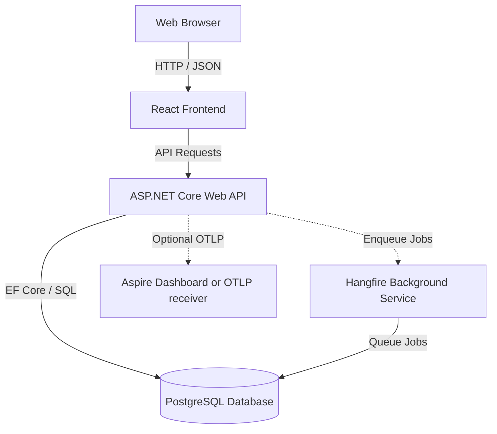

# ADWAIS

A multi-organization platform for e-commerce analytics, endpoint monitoring, and team communication.

<p class="project-links flex flex-wrap gap-4"><a class="inline-flex items-center gap-2 no-underline" href="https://github.com/sojupie/ADWAIS" target="_blank" rel="noopener noreferrer"> <span class="underline decoration-1 underline-offset-3">GitHub repository</span><span class="sr-only"> (opens in new tab)</span></a> <a class="inline-flex items-center gap-2 no-underline" href="https://adwais.marmenlind.com/swagger/index.html" target="_blank" rel="noopener noreferrer"> <span class="underline decoration-1 underline-offset-3">Swagger API</span><span class="sr-only"> (opens in new tab)</span></a></p>

[Live interactive demo](https://adwais.marmenlind.com)

## Architecture

A monorepo managed with pnpm workspaces.



## Directory structure

- `/apps`
  - `/apps/web` - React 19, TypeScript, Vite, Tailwind CSS v3 frontend.
  - `/apps/server` - .NET solution and local PostgreSQL Compose file.
  - `/apps/server/ADWAIS` - ASP.NET Core solution (`src/Api`, `src/Application`, `src/Domain`, `src/Infrastructure`, `tests`).
- `/packages`
  - `/packages/types` - TypeScript types generated from the OpenAPI spec.
- `/docs` - Documentation and the generated OpenAPI spec.
- `/infrastructure` - nginx config baked into the frontend image.
- `/scripts` - Helper scripts.

Other root files: `pnpm-workspace.yaml`, `.env.example`.

Docs: [authentication](https://github.com/sojupie/ADWAIS/blob/main/docs/authentication.md), [multi-organization model](https://github.com/sojupie/ADWAIS/blob/main/docs/multi-organization.md), [observability](https://github.com/sojupie/ADWAIS/blob/main/docs/observability-overview.md), [Shopify order source](https://github.com/sojupie/ADWAIS/blob/main/docs/shopify-integration.md).

## Prerequisites

- Node.js >= 24.15.0
- pnpm >= 11.5.0
- Corepack enabled
- .NET SDK 10.0
- PostgreSQL or Docker

## Quickstart

1. Install dependencies:

```bash
corepack enable
pnpm install
```

2. Configure the environment.

The frontend reads `apps/web/.env.local`. The API reads ASP.NET configuration at runtime.

| File | Required | Contains |
|---|---|---|
| `apps/web/.env.local` | Yes | OIDC settings, SSO branding, demo mode flag |
| `apps/server/ADWAIS/src/Api/appsettings.Development.json` | Tracked | Local database, auth, feature defaults |
| `apps/server/ADWAIS/src/.env` | No | Local overrides |

Copy `apps/web/.env-example` to `apps/web/.env.local` and edit it. Do not put `VITE_*` values in a root `.env.local`. The Vite project is scoped to `apps/web`. Vite fails early when an env file has a UTF-8 BOM.

Demo mode:

```env
# apps/web/.env.local
VITE_DEMO_MODE=true
```

```json
// apps/server/ADWAIS/src/Api/appsettings.Development.json
"EnableDemoAccess": true
```

Demo mode adds a login option that requests a Viewer token from `/api/demo/token`. OIDC settings are not needed in demo mode.

Outside demo mode, set `VITE_OIDC_AUTHORITY` and `VITE_OIDC_CLIENT_ID` in the frontend. Set `Authentication:OidcAuthority` and `Authentication:OidcAudience` in the API.

The API exports live traces, metrics, and structured logs through OTLP only when an endpoint is configured. Set either `OpenTelemetry__OtlpEndpoint` (the preferred .NET configuration key) or `OTEL_EXPORTER_OTLP_ENDPOINT` in the API environment, for example:

```env
# apps/server/ADWAIS/src/.env
OpenTelemetry__OtlpEndpoint=http://localhost:18889
```

This is suitable for an Aspire Dashboard or another OTLP receiver. Leave the setting unset when no telemetry backend is running; the ADWAIS diagnostics pages and API continue to work from the application database.

3. Start the database:

```bash
pnpm db:up
```

4. Apply migrations:

```bash
pnpm migration:update
```

5. Start the frontend:

```bash
pnpm dev:web
```

6. Start the backend:

```bash
pnpm dev:api
```

`EnableRuntimeDataSeeding: true` is already set in `appsettings.Development.json`. Demo monitors use negative local IDs and are never sent to UptimeRobot.

## pnpm scripts

| Script | What it does |
|---|---|
| `pnpm dev:web` | Start the frontend dev server |
| `pnpm dev:api` | Start the backend API |
| `pnpm dev:api:watch` | Start the backend API with hot reload |
| `pnpm codegen` | Regenerate the OpenAPI spec and TypeScript types |
| `pnpm db:up` | Start the local PostgreSQL container |
| `pnpm db:down` | Stop the local PostgreSQL container |
| `pnpm migration:add <Name>` | Create an EF Core migration (stop `dev:api` first) |
| `pnpm migration:update` | Apply pending migrations |
| `pnpm migration:remove` | Remove the last unapplied migration |
| `pnpm migration:list` | List migrations and their status |
| `pnpm dev:web:build` | Build the frontend for production |
| `pnpm dev:web:preview` | Preview the frontend build |

## Code generation

The API project writes `docs/openapi/v1.json` on build. `orval` reads it and generates TypeScript types (`packages/types/generated`) and API hooks (`apps/web/src/api/generated/endpoints.ts`).

Run after API changes:

```bash
pnpm codegen
```

## License

This repository is licensed under the MIT License. See [LICENSE](https://github.com/sojupie/ADWAIS/blob/main/LICENSE) for the full terms.

The MIT copyright and permission notices must remain in source distributions
and substantial portions of the software.

## Contributing

By contributing, you agree to the terms in [CONTRIBUTING.md](https://github.com/sojupie/ADWAIS/blob/main/CONTRIBUTING.md).

## Acknowledgements

Started as a university project. Contributions from David Vilselius, Francisco Vigo Flores, Erik Falk, and Christoffer Bohm.
